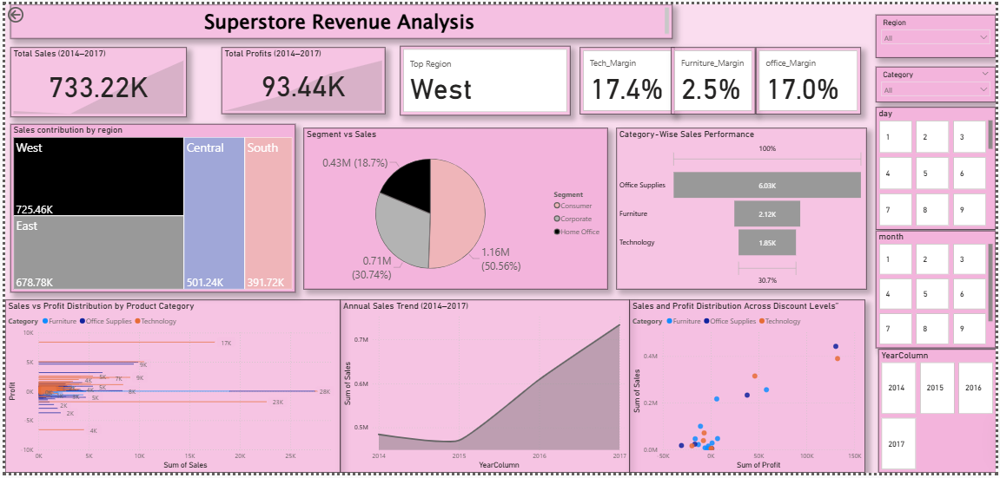

# 📊 Sales Report Dashboard (Power BI)

This repository showcases a Power BI dashboard analyzing sales, profit, and margin performance for a fictional Superstore dataset from 2014 to 2017. The dashboard is designed for business storytelling, highlighting key metrics across product categories, regions, and customer segments.

---

## 🧠 Purpose

To provide actionable insights into revenue drivers, segment contributions, and discount impact — enabling data-driven decisions for retail strategy and profitability optimization.

---

## 📌 Key Features

- **KPI Cards**: Total Sales, Total Profit, and Top Region
- **Multi-row Card**: Profit Margins by Category (Technology, Furniture, Office Supplies)
- **Interactive Slicers**: Region, Category, Segment, Month, Year
- **Visuals**:
  -Pie chart for segment-wise sales
  - Bar charts for category performance and margin distribution
  - Line chart for annual sales trends
  - Scatter plot showing discount impact on profit

---

## 📈 Business Insights

- **Technology and Office Supplies** consistently deliver high profit margins (~17%)
- **Furniture** shows strong sales but low profitability, indicating potential cost or pricing issues
- **West Region** leads in total revenue across all years
- **Consumer Segment** contributes nearly half of total sales
- **Higher discounts** correlate with reduced profit, especially in Furniture and Office Supplies


---

## 📷 Dashboard Preview



> A single-page Power BI dashboard with dynamic visuals, clean layout, and intuitive storytelling.

---

## 🧮 DAX Measures (Sample)

```DAX
Tech Margin = 
CALCULATE(
    DIVIDE(SUM(Profit), SUM(Sales)),
    Category = "Technology"
)
